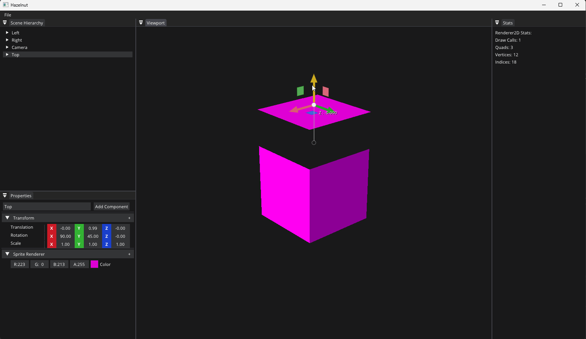
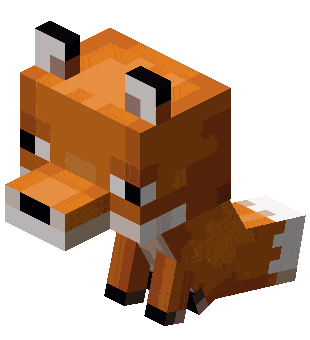

### Hi I'm Jaewoo Roh (노재우) 👋

I'm a **graphics programming enthusiast** exploring the fascinating world of 3D rendering.
I'm passionate about building visually stunning and performant graphics experiences 🐻

<table>
  <tbody>
    <tr>
      <td>
        
      </td>
      <td>
        
      </td>
    </tr>
    <tr>
      <td>Minecraft Clone</td>
      <td>ABCD GameEngine</td>
    </tr>
  </tbody>
</table>

## Quick Resume

🤖 Business Information Technology @ [**Virginia Tech University**][vt]

🐻 Teach Staff @ [**Proof Of Concept University**][pocu] @ [**Assembly**](https://pocu.academy/ko/Courses/COMP2300) [**OOP**](https://pocu.academy/ko/Courses/COMP2500) [**Algorithm**](https://pocu.academy/ko/Courses/COMP3500)

🐯🦁🐋

[vt]: https://www.vt.edu/
[pocu]: https://pocu.academy/ko

## Skills

### Programming languages:
- *Assembly*
  - *6502, x86, SIMD(MMX, SSE, AVX)*
- *C*
  - *C89, C99, C11*
- *C++*
  - *C++98, C++03, C++ Modern*
- *C#*, *Java*, *Python*

### Graphics/GPU:
- *DirectX11*, *OpenGL*, *WebGL*

## Interests:
- Graphics Programming (*DirectX11*, *DirectX12*, *Vulkan*) 🦉
- *Linux* 🐧

_Favorite programming language is *C#*_ 😎

---
